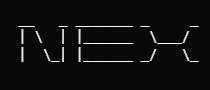

<div align="center">



**Terminal-native peer-to-peer communication.**
Two autonomous terminal peers. No central server.

</div>

---

## What it is

Nex is a chat application that lives in your terminal and connects you directly
to the person you are talking to. Messages travel from your machine to theirs
over an encrypted link. There is no server in the middle holding your
conversation, because there is no server in the middle at all.

That is the whole idea, and everything else follows from it:

- **Your identity is a key on your machine**, not an account somebody issues you.
- **Nobody can read your messages**, because nobody is carrying them.
- **Nothing to shut down.** If every piece of infrastructure in this repository
  disappeared, two people who already know each other could still talk.

## What works today

| | |
| --- | --- |
| Direct encrypted chat | Noise-based transport, forward secrecy, replay and tamper resistance |
| Persistent identity | Long-term keys, trust-on-first-use continuity, explicit verification |
| Encrypted local storage | Message history at rest, with retention you choose |
| Rooms | Host-relayed group chat; the host is a peer, not a server |
| Voice | Protocol and pipeline; real microphone capture is not finished |
| Finding people | Local network discovery, `nex://` invitations, and peer introductions |
| Terminal interface | Two-pane layout, themes, unread state, keyboard-driven |

**Voice does not carry real audio yet**, and video is an experiment. Those are
stated plainly here rather than buried, because a feature table that implies
otherwise is worse than no table.

## Install

**Windows** — one line, no toolchain:

```powershell
irm https://raw.githubusercontent.com/MrEmoji27/nex/main/packaging/install.ps1 | iex
```

It downloads [`v3.0.0-alpha.9`](https://github.com/MrEmoji27/nex/releases/tag/v3.0.0-alpha.9),
checks its SHA256 before running it, and installs a global `nex` command.

**Use alpha.9 or newer.** Every earlier release has at least one fault that
makes the app look broken — commands that appeared to do nothing, an input line
that refused them, a version number that named the wrong build. The older tags
are still on the releases page, labelled, because deleting something people may
have downloaded is worse than saying plainly that it is superseded.

Every release so far is marked **pre-release**, and that is not a formality:
this is an untested alpha and it will have bugs. GitHub only shows a "latest
release" card for a release that is *not* marked pre-release, so this repository
shows a tag count instead. Linking it here was the alternative to relabelling
something to look more finished than it is.

macOS and Linux builds are not published yet — build from source below.

## Building from source

Requires [Bun](https://bun.sh).

```bash
bun install
bun run dev -- --name zro --port 42101 --data-dir data/local/zro
```

On another machine, or in another terminal:

```bash
bun run dev -- --name roshan --port 42102 --data-dir data/local/roshan
```

Then in either one, `/invite` prints a `nex://` code. Paste it into the other
and you are talking. The code carries a fingerprint, so the first connection is
checked rather than trusted.

Packaging details, hashes and the release process live in `packaging/`.

## Finding people who are not on your network

Two people on the same Wi-Fi find each other automatically. Across the internet
they need to have swapped a `nex://` code first, which is fine between people who
already know each other and useless between people who do not.

The optional **Rendezvous** service closes that gap. It answers the question
"is there someone here called `roshan`?" and passes along one introduction. If
Roshan accepts, the two nodes connect **directly** and the service is finished.

It is off by default. It cannot read your messages, and it is not able to — the
control channel has no message type that can carry content. It cannot prove who
anyone is either; that is settled between the two nodes afterwards.

```bash
/rendezvous on https://your-service roshan
/find roshan
/ask roshan
```

## Why this exists

[**How Nex was built, and what it is for**](doc/HOW-AND-WHY.md) — the thesis, what
it costs, the three ways two people find each other, and the encryption bug that
taught this project not to trust its own test suite.

## Layout

```
src/          the client — identity, transport, rooms, voice, terminal UI
rendezvous/   the optional discovery service (Go)
audio/        native sidecar — capture, Opus, echo cancellation (Rust)
tests/        unit suites, plus live multi-node smoke tests
doc/          how and why this was built
packaging/    Windows installer
```

## Building and testing

```bash
bun install
bun test                 # unit suite
bun run typecheck        # tsc --noEmit

cd rendezvous
go test ./...            # service suite, including RFC 8032 vectors
```

Live multi-node tests are separate, because they bind real ports:

```bash
bun tests/live-two-node.ts
bun tests/live-room-voice.ts
bun tests/live-rendezvous-union.ts   # needs a running rendezvous service
```

## On the security claims

Nex uses a Noise-based encrypted transport with long-term X25519 identity keys.
Every claim in that sentence has a test behind it, and where a test could not be
written the gap is written down instead.

One lesson from this codebase is worth repeating, because it cost real time:

> An audit found an implementation labelled `Noise_XX` that did not conform to
> `Noise_XX`. Three deviations, every one of them symmetric — so two Nex nodes
> agreed with each other perfectly and the entire in-house test suite passed
> while the result was not the protocol it advertised and would not have
> interoperated with anything else.

It was found by testing against **foreign** vectors, not our own output. The
same rule now governs the rendezvous work: the Go service and the TypeScript
client are checked against published RFC 8032 vectors and against a shared
vector file that neither of them owns.

Two implementations agreeing is not evidence. Both can be wrong the same way.

## Status

Alpha. The protocol has already changed once in a way that broke compatibility
between builds, and it may again before 1.0. Breaking changes are called out
explicitly in the release notes; a note that softens one is worse than no note.

## License

**AGPL-3.0-or-later** — see [`LICENSE`](LICENSE) and [`NOTICE`](NOTICE).

Copyright © 2026 **zemo** ([@MrEmoji27](https://github.com/MrEmoji27)).

`LICENSE` holds the AGPL text verbatim and unedited, because GitHub and other
tooling only recognise a licence they can match byte for byte — the copyright
line lives here and in `NOTICE` instead, which is where GNU says to put it.

Chosen deliberately over a permissive licence. Nex's premise is that no server
carries your messages and nobody else can read them; under MIT, someone could
strip those properties out and run the result as a hosted service without ever
showing anyone the change. Section 13 closes that — a modified version offered
over a network has to offer its source too.

It does not forbid commercial use. It requires that changes stay visible.
